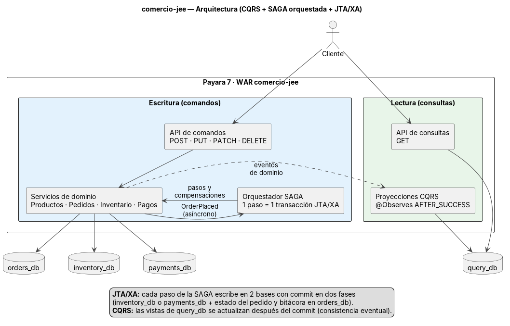

# comercio-jee — Pedidos con SAGA, CQRS y JTA/XA sobre Jakarta EE 11

Backend del taller de **Arquitectura de Software**: gestión de pedidos de e-commerce con tres dominios
(pedidos, inventario y pagos) que aplica **JPA**, **JTA con transacciones distribuidas XA**, el patrón
**SAGA orquestado** con **operaciones compensatorias** y **CQRS** con consistencia eventual.

| Tecnología | Versión |
|---|---|
| Jakarta EE | 11 (`jakarta.jakartaee-api` 11.0.0) |
| Servidor | Payara Server 7 (`payara/server-full:7.2026.6`), EclipseLink 5, Weld 6 |
| Java | 21 |
| Base de datos | PostgreSQL 16 + driver JDBC 42.7.13 (`PGXADataSource`) |
| Pruebas | JUnit 5.14 + Mockito 5 |

> **Compatibilidad:** todo funciona sobre Payara 7 / Jakarta EE 11, así que no hizo falta bajar a Payara 6.
> El único ajuste fue **no** fijar `eclipselink.target-database=PostgreSQL`: con ese valor EclipseLink 5
> genera `BIGINT SERIAL` (DDL inválido). Con la plataforma autodetectada genera `GENERATED BY DEFAULT AS IDENTITY`.

---

## 1. Descripción y arquitectura

```
src/main/java/com/comercio
├── catalog   productos e inventario   (domain · application · infrastructure · api)
├── order     pedidos                  (domain · application · infrastructure · api)
├── payment   pagos + pasarela simulada (domain · application · infrastructure)
├── saga      orquestador, pasos, bitácora (domain · application · infrastructure · api)
├── query     modelo de lectura CQRS: vistas, proyectores, query services y recursos de consulta
└── shared    excepciones de dominio, eventos CDI, ExceptionMappers, @ApplicationPath("api"), datasources
```

Cada dominio separa `domain` (entidades JPA), `application` (command services), `infrastructure`
(repositorios) y `api` (recursos REST con DTOs `record`). **Ninguna entidad JPA sale por la API**: los
recursos siempre convierten a records.

### Cuatro bases, cuatro unidades de persistencia, cuatro datasources XA

| Base | Persistence unit | Datasource (JNDI) | Contenido |
|---|---|---|---|
| `orders_db` | `ordersPU` | `java:app/jdbc/orders` | `Order`, `OrderItem`, `SagaInstance`, `SagaStep` |
| `inventory_db` | `inventoryPU` | `java:app/jdbc/inventory` | `Product`, `InventoryReservation` |
| `payments_db` | `paymentsPU` | `java:app/jdbc/payments` | `Payment` |
| `query_db` | `queryPU` | `java:app/jdbc/query` | `ProductCatalogView`, `OrderSummaryView`, `PaymentView` |

Los datasources se declaran con `@DataSourceDefinition` en
[`DataSourcesConfiguration`](src/main/java/com/comercio/shared/infrastructure/DataSourcesConfiguration.java)
con `className = org.postgresql.xa.PGXADataSource`. Host y credenciales se leen con MicroProfile Config
(`${MPCONFIG=db.host}`, …): los valores por defecto (`localhost`, `comercio`/`comercio`) están en
`META-INF/microprofile-config.properties` y se sobrescriben con las variables de entorno `DB_HOST`,
`DB_USER` y `DB_PASSWORD` (docker-compose usa `DB_HOST=postgres`).

`persistence.xml` define las 4 unidades JTA con `drop-and-create` (el esquema se recrea en cada despliegue)
y `inventoryPU` carga 6 productos semilla desde `META-INF/sql/inventory-seed.sql`.

### Diagrama de arquitectura



Fuente: [`docs/architecture.puml`](docs/architecture.puml). Para regenerar el PNG (sin instalar PlantUML):

```bash
docker run --rm -v "$PWD/docs:/data" plantuml/plantuml -tpng -charset UTF-8 /data/architecture.puml
```

---

## 2. Orquestación frente a coreografía

Se eligió una **SAGA orquestada** ([`OrderSagaOrchestrator`](src/main/java/com/comercio/saga/application/OrderSagaOrchestrator.java)):

- **El flujo es lineal y fijo**: reservar inventario → cobrar → confirmar. No hay ramas que dependan de
  terceros ni participantes que se suscriban dinámicamente, así que un coordinador central lo expresa en
  unas pocas líneas legibles en vez de repartirlo en reacciones a eventos.
- **Compensaciones centralizadas**: el orquestador apila la compensación de cada paso completado y, si algo
  falla, las desapila en orden inverso (LIFO). Con coreografía cada servicio tendría que saber qué eventos de
  fallo escuchar y qué deshacer.
- **SAGA auditable**: el estado (`INICIADA → COMPENSANDO → COMPLETADA | COMPENSADA | FALLIDA`) y la bitácora
  de pasos (`SagaStep`: nombre, EJECUTAR/COMPENSAR, OK/ERROR, detalle, hora) viven en un solo lugar y se
  consultan con `GET /orders/{id}/saga`.
- **Sin dependencias cíclicas**: el orquestador depende de los servicios de inventario, pagos y pedidos;
  ninguno de ellos conoce al orquestador ni a los demás. En coreografía, pedidos escucha a pagos, pagos a
  inventario, inventario a pedidos… y aparece un ciclo de eventos.
- **Más fácil de probar**: toda la lógica de decisión está en una clase que se prueba de forma síncrona con
  Mockito ([`OrderSagaOrchestratorTest`](src/test/java/com/comercio/saga/application/OrderSagaOrchestratorTest.java)),
  sin servidor, base de datos ni mensajería.

El costo es un punto central de coordinación; en este sistema (un solo despliegue) no supone un problema.

---

## 3. SAGA y JTA: por qué conviven

**SAGA gobierna el flujo macro sin una transacción global.** Cada paso es una transacción local que hace
commit al terminar (`@Transactional(REQUIRES_NEW)` en
[`OrderSagaSteps`](src/main/java/com/comercio/saga/application/OrderSagaSteps.java)). Entre un paso y el
siguiente nada está bloqueado: si el pago falla, lo ya confirmado no se deshace con un rollback, sino con
**compensaciones** (liberar inventario, cancelar pedido). El resultado es **consistencia eventual**: durante
unos milisegundos el pedido está en `INVENTARIO_RESERVADO` y otros clientes ven ese stock reservado.

**JTA/XA se usa solo DENTRO de cada paso.** Cada paso escribe en dos bases: el cambio de dominio
(`inventory_db` o `payments_db`) y el estado del pedido más su `SagaStep` (`orders_db`). Ambas unidades usan
datasources XA, así que Payara las enlista en la misma transacción JTA y al salir del método ejecuta
**two-phase commit**: `PREPARE TRANSACTION` en las dos bases y, si ambas responden OK, `COMMIT PREPARED`.
Si cualquiera falla, se deshacen **las dos**. Así es imposible que, por ejemplo, quede stock reservado sin
que el pedido ni la bitácora lo registren, o que la bitácora diga "OK" sobre un cambio que no ocurrió.

| Paso | Bases en la misma transacción XA |
|---|---|
| 1. `reserveInventory` | `inventory_db` (reservas, `reserved`) + `orders_db` (INVENTARIO_RESERVADO, SagaStep) |
| 2. `processPayment` | `payments_db` (pago) + `orders_db` (PAGO_APROBADO o PAGO_RECHAZADO, SagaStep) |
| 3. `confirmOrder` | `inventory_db` (reservas CONFIRMADA, sale el stock) + `orders_db` (CONFIRMADO, SAGA COMPLETADA) |
| C2. `releaseInventory` | `inventory_db` (reservas LIBERADA) + `orders_db` (INVENTARIO_LIBERADO, SagaStep) |
| C1. `cancelOrder` | `orders_db` (CANCELADO, SAGA COMPENSADA) |

Detalles que se ven en el código:

- Los servicios de dominio que participan (`InventoryCommandService`, `PaymentCommandService`,
  `OrderCommandService.changeStatus`) son `@Transactional(MANDATORY)`: solo pueden ejecutarse dentro de la
  transacción del paso.
- Un **pago rechazado** no es un error técnico: el pago `RECHAZADO`, el pedido en `PAGO_RECHAZADO` y el paso
  con `ERROR` deben confirmarse juntos. Por eso `processPayment` usa
  `@Transactional(value = REQUIRES_NEW, dontRollbackOn = PaymentRejectedException.class)`: hace commit 2PC y
  luego propaga la excepción para que el orquestador compense.
- PostgreSQL trae `max_prepared_transactions = 0`; el `docker-compose.yml` lo arranca con `100`. Sin eso el
  `PREPARE TRANSACTION` falla.
- Comprobado en ejecución: con `log_statement=all`, un pedido válido produce 6 `PREPARE TRANSACTION` y
  6 `COMMIT PREPARED` (3 pasos × 2 bases), con el mismo identificador global y distinto *branch qualifier*.

**Trade-off.** Este diseño acopla el orquestador a las bases de los otros dominios: el paso de inventario
escribe a la vez en `inventory_db` y en `orders_db`, algo que solo es posible porque todo vive en el mismo
servidor de aplicaciones. Además, 2PC bloquea recursos durante el *prepare* y depende de que el
coordinador se recupere bien tras una caída. En microservicios reales cada servicio tendría su propia base y
no se compartiría una transacción: se reemplazaría por **Transactional Outbox + mensajería** (el cambio
de dominio y el mensaje "paso completado" se escriben en la misma transacción **local**, y un relay lo
publica en un broker hacia el orquestador), sin 2PC y con consumidores idempotentes.

### Pasos, compensaciones y reintentos

```
T1 registrar pedido (POST /orders)   ──compensa──▶ C1 cancelar pedido
T2 reservar inventario               ──compensa──▶ C2 liberar inventario
T3 procesar pago        ← pivote: a partir de aquí ya no se compensa
T4 confirmar pedido     ← reintentable
```

- El orquestador apila `C1` al empezar y `C2` cuando T2 termina; ante un fallo las ejecuta en orden LIFO.
- **Sin stock**: T2 hace rollback (no se reservó nada), así que la pila solo tiene `C1`: el pedido pasa de
  `PENDIENTE` a `CANCELADO`, la SAGA a `COMPENSADA` y nunca se llama al pago.
- **Pago rechazado** (`paymentMethod = "FAIL"` o monto > 5.000.000): `PAGO_RECHAZADO` → `C2` →
  `INVENTARIO_LIBERADO` → `C1` → `CANCELADO`. La SAGA queda `COMPENSADA`.
- **Compensaciones idempotentes y reintentables**: liberar solo toca reservas `RESERVADA`; cancelar no
  transiciona un pedido ya cancelado. Cada compensación se intenta hasta 4 veces (1 + 3 reintentos, con
  espera creciente) y cada intento fallido queda en la bitácora. Si se agotan, la SAGA queda **FALLIDA**
  (intervención manual) y no se ejecutan las compensaciones restantes.
- Los fallos **técnicos** de los pasos hacia adelante también se reintentan (3 veces); los de **negocio**
  (sin stock, pago rechazado) no, porque repetirlos no cambia el resultado. Un fallo técnico del pago se
  trata como rechazo (se compensa). Si `confirmOrder` falla después del pivote, se reintenta y, si sigue
  fallando, la SAGA queda FALLIDA (no tiene sentido devolver el inventario de un pedido ya cobrado).
- Idempotencia de los datos: `InventoryReservation` es única por `(orderId, productId)` y `Payment` es único
  por `orderId` (reintentar el cobro devuelve el pago existente sin llamar de nuevo a la pasarela).
- Todo se registra con `java.util.logging` (`[SAGA <orderId>] Paso 1…`, `Compensación…`, `COMPENSADA`…).

### Arranque asíncrono y seguro

`POST /orders` persiste el pedido en `PENDIENTE` y publica el evento `OrderPlaced`. El orquestador lo observa
con `@Observes(during = TransactionPhase.AFTER_SUCCESS)`: **solo arranca si la transacción del pedido hizo
commit**. Entonces envía la SAGA a un `ManagedExecutorService` y la petición responde `202 Accepted` sin
esperar.

### Concurrencia sobre el stock: `PESSIMISTIC_WRITE`

Se eligió **bloqueo pesimista** (`LockModeType.PESSIMISTIC_WRITE`, es decir `SELECT … FOR UPDATE`) al
reservar, liberar y confirmar. Las reservas concurrentes del mismo producto se serializan hasta el commit 2PC
del paso, así que no hay sobreventa y no hacen falta reintentos por conflicto. Los productos de un pedido se
bloquean en orden de id para evitar interbloqueos. `@Version` sigue presente en `Product` (y en `Order`): protege
las ediciones administrativas (PUT/PATCH) frente a actualizaciones perdidas (`OptimisticLockException` → 409)
y sirve para ordenar las proyecciones CQRS.

Comprobado: 8 pedidos simultáneos de 1 unidad contra un producto con stock 3 terminan en exactamente
3 `CONFIRMADO` y 5 `CANCELADO`, con stock final 0.

---

## 4. CQRS y consistencia eventual

- **Lado de escritura**: `*CommandService` + `*CommandResource` sobre `ordersPU`, `inventoryPU` y
  `paymentsPU`. Al cambiar algo publican eventos de dominio con `jakarta.enterprise.event.Event`:
  `ProductChanged`, `StockChanged`, `OrderStatusChanged` (además de `PaymentProcessed` y `OrderPlaced`).
- **Lado de lectura**: proyectores ([`CatalogProjector`](src/main/java/com/comercio/query/application/CatalogProjector.java),
  `OrderSummaryProjector`, `PaymentProjector`) observan esos eventos con
  `@Observes(during = AFTER_SUCCESS)` y actualizan las vistas en una **transacción nueva**
  (`REQUIRES_NEW`) sobre `queryPU`. Los `*QueryService` + `*QueryResource` **solo leen `queryPU`**; la única
  excepción es `GET /orders/{id}/saga`, que lee la bitácora de `ordersPU`.
- **Vistas**: `ProductCatalogView` (productId, sku, name, price, stock, reserved, available, active),
  `OrderSummaryView` (orderId, customerId, status, total, itemsCount, updatedAt) y `PaymentView`.

Qué implica la **consistencia eventual**:

- `AFTER_SUCCESS` garantiza que nunca se proyecta un cambio que luego hizo rollback, pero la vista se
  actualiza **después** del commit del comando: hay una ventana (milisegundos) en la que la lectura muestra
  el estado anterior. Por eso, tras `POST /orders`, el cliente consulta `GET /orders/{id}` hasta ver
  `CONFIRMADO` o `CANCELADO`.
- Si una proyección falla, el comando ya está confirmado y la vista queda atrasada hasta el siguiente evento
  de esa entidad (no hay rollback del comando). Al arrancar, el catálogo se **reconstruye** republicando la foto
  de cada producto (así se proyectan también los productos semilla, insertados por SQL).
- Los eventos llevan la `@Version` de la entidad origen y la foto completa; el proyector bloquea la fila de la
  vista y **descarta eventos atrasados**, así que dos sagas concurrentes sobre el mismo producto no dejan la
  vista en un estado viejo.
- Cada lado se puede optimizar por separado: la vista del catálogo ya trae `available` calculado y la de
  pedidos no necesita joins.

---

## 5. Máquina de estados del pedido

| Desde | Hacia |
|---|---|
| `PENDIENTE` | `INVENTARIO_RESERVADO`, `CANCELADO` |
| `INVENTARIO_RESERVADO` | `PAGO_APROBADO`, `PAGO_RECHAZADO` |
| `PAGO_APROBADO` | `CONFIRMADO` |
| `PAGO_RECHAZADO` | `INVENTARIO_LIBERADO` |
| `INVENTARIO_LIBERADO` | `CANCELADO` |
| `CONFIRMADO`, `CANCELADO` | — (terminales) |

`Order.transitionTo(nuevo)` valida contra esta tabla
([`OrderStatus`](src/main/java/com/comercio/order/domain/OrderStatus.java)) y lanza
`InvalidOrderStateException` (409) si la transición no está permitida.

Estados de la SAGA: `INICIADA → COMPLETADA` en el flujo feliz; `INICIADA → COMPENSANDO → COMPENSADA` al
compensar; `FALLIDA` si se agotan los reintentos. Reservas: `RESERVADA → CONFIRMADA | LIBERADA`. Pagos:
`APROBADO | RECHAZADO`.

---

## 6. Cómo ejecutar

Requisitos: JDK 21 y Docker (con Docker Compose).

```bash
./mvnw clean package && docker compose up --build
```

- La API queda en `http://localhost:8080/comercio-jee/api` (por ejemplo `GET /comercio-jee/api/products`).
- Postgres se publica en `localhost:5432` (usuario y contraseña `comercio`); consola de Payara en `https://localhost:4848`.
- Payara despliega el WAR unos 30 s después de que el contenedor arranca; espere a ver
  `comercio-jee was successfully deployed` en `docker compose logs -f payara`.
- Si algún puerto del host está ocupado, cámbielo sin tocar el compose:

```bash
PAYARA_HTTP_PORT=8081 POSTGRES_HOST_PORT=5433 docker compose up --build
```

- Para empezar de cero basta con reiniciar Payara: el esquema se recrea (`drop-and-create`) y se recargan los
  productos semilla.

Solo pruebas unitarias (no necesitan Docker):

```bash
./mvnw test
```

---

## 7. Endpoints y escenarios de prueba

Base: `/comercio-jee/api`

### Comandos (escritura)

| Método | Ruta | Descripción | Respuesta |
|---|---|---|---|
| POST | `/products` | `{sku, name, price, stock, active?}` | 201 + Location |
| PUT | `/products/{id}` | reemplazo completo `{sku, name, price, stock, active}` | 200 |
| PATCH | `/products/{id}/price` | `{price}` | 200 |
| PATCH | `/products/{id}/availability` | `{stock?, active?}` (al menos uno) | 200 |
| DELETE | `/products/{id}` | borrado lógico (`active=false`) | 204 |
| POST | `/orders` | `{customerId, items:[{productId, quantity}], paymentMethod}` | **202** `{orderId, status}` |

### Consultas (lectura, `query_db`)

| Método | Ruta | Descripción |
|---|---|---|
| GET | `/products`, `/products/{id}` | catálogo |
| GET | `/inventory` | stock, reservado y disponible (= stock − reservado) |
| GET | `/orders/{id}` | resumen del pedido |
| GET | `/orders?customerId=` | pedidos de un cliente (sin parámetro: los 100 más recientes) |
| GET | `/orders/{id}/saga` | estado y bitácora de la SAGA (**lee `orders_db`**) |
| GET | `/payments?orderId=` | pagos de un pedido |

### Errores

Todas las respuestas de error tienen la forma `{"error": "...", "message": "...", "timestamp": "..."}`.

| Código | Cuándo | `error` |
|---|---|---|
| 400 | Bean Validation o JSON mal formado | `VALIDATION_ERROR`, `MALFORMED_JSON` |
| 404 | producto/pedido inexistente | `PRODUCT_NOT_FOUND`, `ORDER_NOT_FOUND` |
| 409 | stock insuficiente, transición inválida, sku duplicado, `@Version` | `INSUFFICIENT_STOCK`, `INVALID_ORDER_STATE`, `DUPLICATE_SKU`, `CONCURRENT_MODIFICATION` |
| 422 | regla de negocio: pago rechazado, producto inactivo | `PAYMENT_REJECTED`, `BUSINESS_RULE_VIOLATION` |

### Productos semilla

| id | sku | precio | stock |
|---|---|---|---|
| 1 | LAP-001 Portátil | 3.500.000 | 10 |
| 2 | MOU-001 Mouse | 65.000 | 50 |
| 3 | KEY-001 Teclado | 180.000 | 25 |
| 4 | MON-001 Monitor 4K | 1.450.000 | 3 |
| 5 | HDS-001 Audífonos | 210.000 | 15 |
| 6 | USB-001 Memoria USB | 35.000 | 100 |

### Escenarios de punta a punta

La SAGA y las proyecciones son **asíncronas**: después de `POST /orders`, consulte `GET /orders/{id}` varias
veces hasta llegar a `CONFIRMADO` o `CANCELADO`; luego revise `/orders/{id}/saga`, `/inventory` y
`/payments?orderId=`.

| Escenario | Pedido | Resultado esperado |
|---|---|---|
| 1. Válido | 2 × producto 2 + 1 × producto 3, `TARJETA` | `CONFIRMADO`; stock 50→48 y 25→24; SAGA `COMPLETADA` (INICIAR, RESERVAR, PROCESAR_PAGO, CONFIRMAR); pago `APROBADO` |
| 2. Pago rechazado | 1 × producto 1, `FAIL` | `CANCELADO`; stock sin cambios y reservas `LIBERADA`; SAGA `COMPENSADA` con `PROCESAR_PAGO ERROR`, `LIBERAR_INVENTARIO` y `CANCELAR_PEDIDO` (COMPENSAR); pago `RECHAZADO` |
| 3. Sin stock | 10 × producto 4 (stock 3) | `CANCELADO`; `RESERVAR_INVENTARIO ERROR` + `CANCELAR_PEDIDO`; SAGA `COMPENSADA`; **sin pago** |
| Variante de 2 | 2 × producto 1 (7.000.000 > 5.000.000) | igual que el escenario 2, motivo "supera el máximo permitido" |

Material de prueba:

- [`docs/requests.http`](docs/requests.http): para el cliente HTTP de IntelliJ o la extensión REST Client
  de VS Code.
- [`docs/postman/comercio-jee.postman_collection.json`](docs/postman/comercio-jee.postman_collection.json):
  colección con los 3 escenarios y sus aserciones. "Esperar estado final" se repite a sí misma con
  `setNextRequest` cada 500 ms (máx. 30 veces) hasta llegar a un estado final, así que debe ejecutarse con el
  **Collection Runner** o con newman:

```bash
docker run --rm --network comercio-jee_default -v "$PWD/docs/postman:/etc/newman" postman/newman run comercio-jee.postman_collection.json --env-var "baseUrl=http://payara:8080/comercio-jee/api"
```

### Pruebas automatizadas

`./mvnw clean package` ejecuta 25 pruebas síncronas:

- [`OrderSagaOrchestratorTest`](src/test/java/com/comercio/saga/application/OrderSagaOrchestratorTest.java)
  (Mockito): éxito; pago rechazado con verificación `InOrder` de que las compensaciones van en orden inverso
  (liberar inventario → cancelar pedido); sin stock (sin pago ni liberación); reintentos de compensación; compensación
  agotada → `FALLIDA`; fallo técnico de pago; fallo después del pivote; fallo de la bitácora.
- [`OrderTransitionsTest`](src/test/java/com/comercio/order/domain/OrderTransitionsTest.java): tabla de
  transiciones, caminos válidos, transiciones inválidas y estados terminales.
